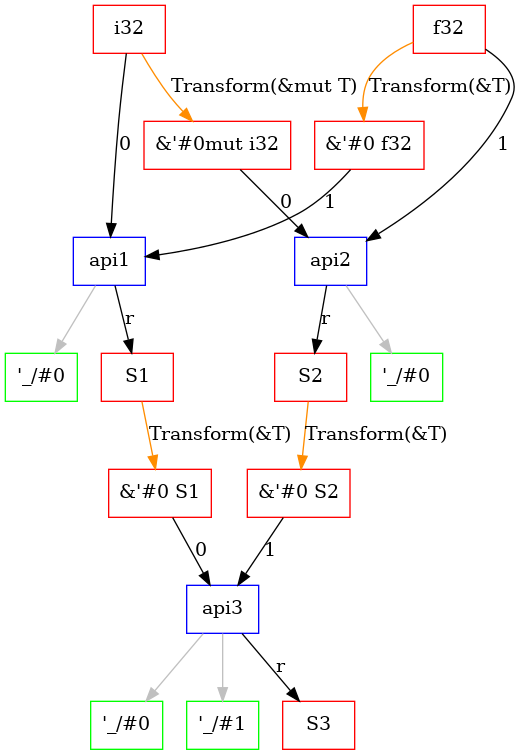

# Chapter 5.2. API-Dependency Graph

## Overview

The **API Dependency Graph** is a directed graph structure that models dependencies among APIs, types, and generic parameters by traversing the APIs within a Rust library or crate. It contains three types of nodes: API, type and generic parameter. And it contains four types of edges : Arg(usize, recording the location in API parameter), Ret, Generic and Transform(TransformKind, recording the relation between types, such as T and &T, &mut T). Now this module is still under development and generic is not supported.

Use the following example to demonstrate this graph structure. 

```rust
pub struct S1 {
    pub a: i32,
    pub b: f32,
}

pub struct S2 {
    pub a: i32,
    pub b: f32,
}

pub struct S3 {
    pub a: i32,
    pub b: f32,
}

pub fn api1(arg1: i32, arg2: &f32) -> S1 {
    S1 { a: arg1, b: *arg2 }
}
pub fn api2(arg1: &mut i32, arg2: f32) -> S2{
    S2 { a: *arg1, b: arg2 }    
}

pub fn api3(arg1: &S1, arg2: &S2) -> S3{
    S3 { a: arg1.a, b: arg2.b }
}
```

By scanning the code above, we generate an API Dependency Graph like this:



## Quick Usage Guide

If your project doesn't have a rust-toolchain.toml, you need to create such a file contains the following content:

```
[toolchain]
# The default version of the rustc compiler
channel = "nightly-2024-10-12"
components = ["rustc-dev", "rust-src", "llvm-tools-preview"]

```

We use this feature for generating fuzz targets about library APIs. You can use this feature with the following command(Make sure you are in a cargo project):

```bash
cargo rapx -testgen
```

This command will analyse your project and gengerate a .dot file in the current directory, which contains the API dependency graph information, and also generate a new project in the parent directory. The new project is a fuzz target that contains APIs in your project.You can visualize this graph by using one of the following commands.

```bash
dot -Tsvg your_crate_name.dot -o api_graph.svg
dot -Tpng your_crate_name.dot -o api_graph.png
```

To utilize the analysis results, you can use the module as follows:

```rust
use analysis::core::api_dep; // Import the module
let api_graph = api_dep::ApiDep::new(tcx).start(true) // true: collect only pub APIs; false: collect all APIs
```

The above codes can generate an API dependency graph based on your crate.

### Graph APIs

The `ApiDepGraph` struct provides several APIs for interacting with the dependency graph. Below are the key methods. Before using these APIs, you need to import relevent module:

```rust
use analysis::core::api_dep::graph; // Import the module
```

#### `statistics`

Returns statistics about the graph, including counts of API nodes, type nodes, generic parameter nodes, and edges.

```rust
// Here is the definition of Statistics
pub struct Statistics {
    pub api_count: usize,
    pub type_count: usize,
    pub generic_param_count: usize,
    pub edge_cnt: usize,
}
pub fn statistics(&self) -> Statistics
```

#### `inner_graph`

Returns reference of the graph data.

```rust
pub fn inner_graph(&self) -> &InnerGraph<'tcx> // InnerGraph is Graph<DepNode<'tcx>, DepEdge>
```

#### `provider_tys`

Returns a list of types that can be transformed into the **ty** type.

```rust
pub fn provider_tys(&self, ty: Ty<'tcx>) -> Vec<Ty<'tcx>>
```

#### `all_transform_for`

Returns all transformation kinds applicable to the specified type.

```rust
pub fn all_transform_for(&self, ty: Ty<'tcx>) -> Vec<TransformKind>
```

#### `get_node`

Retrieves or creates a node index for a given `DepNode`. If node doesn't exist in graph, it will add this node into the graph and return it's NodeIndex.

```rust
pub fn get_node(&mut self, node: DepNode<'tcx>) -> NodeIndex
```

#### `get_index_by_node`

Given a DepNode, returns `Option<Nodeindex>`, cause it may not exist in the graph

```rust
pub fn get_index_by_node(&self, node: DepNode<'tcx>) -> Option<NodeIndex>
```

The feature is based on our RuMono paper, which was published in TOSEM.

```
@article{zhangrumono,
  title={RuMono: Fuzz Driver Synthesis for Rust Generic APIs},
  author={Zhang, Yehong and Wu, Jun and Xu, Hui},
  journal={ACM Transactions on Software Engineering and Methodology},
  publisher={ACM New York, NY}
}
```
