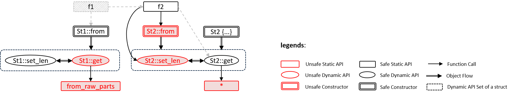
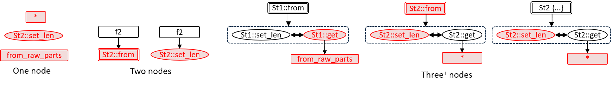
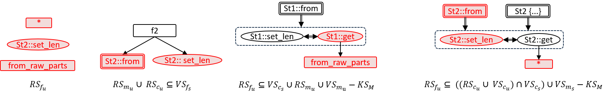
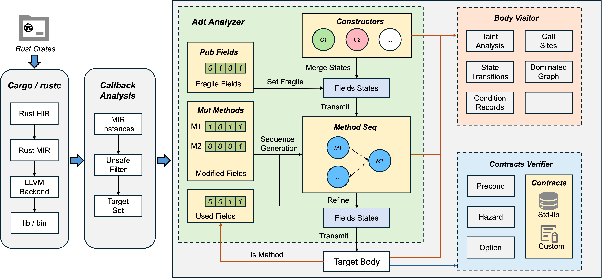
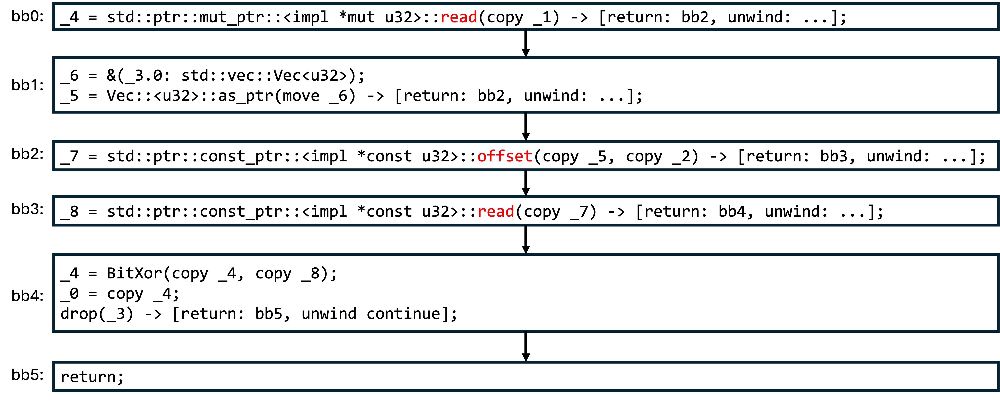
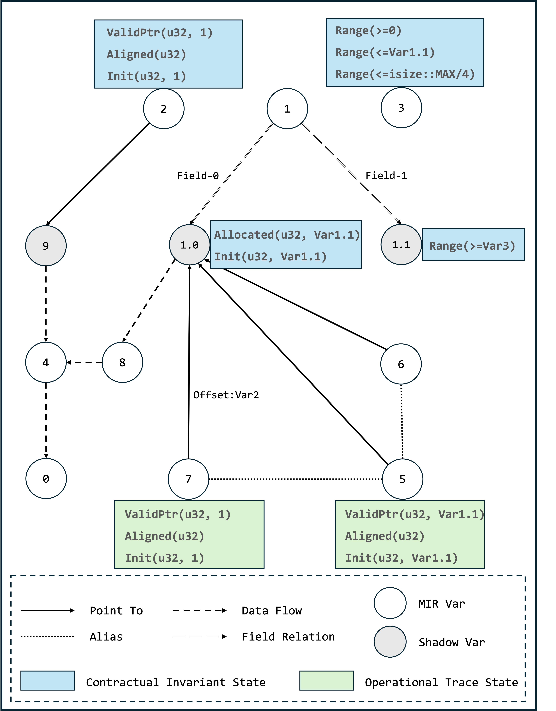

# Chapter 6.4. Unsafe Code Audit and Verification
## 1 Overview
Unsafe Code enables necessary low-level operations, but it bypasses Rust's compiler guarantees, potentially introducing ​​undefined behavior (UB)​​ if used incorrectly. 

This module employs call graph segmentation and dataflow analysis for systematic code auditing, and utilizes abstract interpretation and contract-based verification to check safety properties. Specifically, it operates on three core pillars:

(1) Audit unit generation: Segmenting Rust code into independent units to set analysis boundaries for verification and inference.

(2) Safety property verification: Verifying if the safety properties required by unsafe APIs are satisfied.

(3) Safety property inference: Inferring the safety properties of unsafe APIs based on the audit unit.

### Core Assumptions
Our approach rests on two foundational assumptions:
* **P1:** All undefined behavior originates from unsafe code blocks
* **P2:** A function is sound if all execution paths satisfy safety properties of unsafe operations they interact with.

## 2 Audit Unit Generation
### 2.1 What's the Audit Unit
Audit unit is the foundational abstraction which defines analysis boundaries for verification and inference.

### 2.2 Why Audit Unit Is Needed
Just as our assumption **P1** states, undefined behavior (UB) only originates from unsafe code blocks. Therefore, the detection of UB essentially involves the management of unsafe code.

Given a Rust crate, there are three typical scenarios to be considered for unsafe code handling: 

* Original unsafe code annotation: (i) Unsafe code in a Rust crate without any other internal unsafe code; (ii) An unsafe API originating from another library outside the crate.

* Safe property delegation: An unsafe API which exposes the safety requirements of internal unsafe code.

* Safety encapsulation: A safe API which fully enforces all necessary safety properties of internal unsafe code.

These scenarios inherently have boundaries, where the unsafety propagation can be contained or observed. Therefore, to effectively isolate, analyze, and verify the safety of unsafe code, we establish audit units to enable focused and manageable safety audits.

### 2.3 How to Construct and Use Audit Unit

#### 2.3.1 Audit Unit Construction
The audit unit combines the traditional call graph with unsafe and dataflow information to capture the use and propagation of unsafe code across the project. It is constructed as follows:

(1) Identify all functions and methods with unsafe markers. Add call and object-flow edges to form unsafety propagation graphs (UPG).

(2) Divide UPG according to the structural patterns of basic units (More detailed information can be obtained from [our paper](https://arxiv.org/abs/2504.21312)).

(3) Merge basic units when multiple unsafe callees share a common caller or when a dynamic-method caller has multiple constructors to construct audit units.

#### 2.3.2 Audit Unit Usage
The **audit unit** constitutes the foundational abstraction, defining analysis boundaries for verification and inference. It integrates with the [tag-std](https://github.com/Artisan-Lab/tag-std/blob/main/primitive-sp.md) - a comprehensive taxonomy of safety properties extracted from Rust's standard library - to establish a unified analytical foundation.

**Usage Summary**: Audit Unit → Set analysis scope → tag-std (safety rules) → Contracts verified or UB detected.

#### 2.3.3 Poc of Audit Unit
Here is a simple structure along with its corresponding constructor and methods.

```rust
/// Record secret buffer with its size.
struct SecretRegion {
    buffer: Vec<u32>,
    len: usize,
}

impl SecretRegion {
    pub unsafe fn from(v: Vec<u32>, l: usize) -> Self {
        SecretRegion { buffer: v, len: l }
    }
    
    pub unsafe fn set_len(&mut self, l:usize) {
        self.len = l;
    }
    
    pub unsafe fn xor_secret_region(
        &self,
        ptr: *mut u32,
        offset: isize,
    ) -> u32 {
        let mut src_value = ptr.read();
        let secret_ptr = self.buffer.as_ptr();
        let secret_region_ptr = secret_ptr.offset(offset);
        let secret_value = secret_region_ptr.read();
        src_value ^= secret_value;
        src_value
    }
}

fn f() {
    let mut v = vec![0xDEADBEEF, 0xCAFEBABE, 0x12345678];
    let mut data = [0x11111111, 0x22222222, 0x33333333];
    let (p,l,_c) = v.into_raw_parts();
    let mut s = unsafe { SecretRegion::from(p, 0)};
    unsafe { 
        s.set_len(l);
        s.xor_secret_region(data.as_mut_ptr(), 0);
    }
}
```

Figure 1a-1c shows the specific generation process of the audit units for the code. Here, we use **required safety property (RS)** and **verified safety property (VS)** to construct an audit formula to describe the satisfaction conditions of each audit unit. **RS** and **VS** are sets of safety tags from tag-std.



**Fig-1a**: Unsafety propagation graph. Function calls like `f -> Vec::into_raw_parts` are not considered in the UPG because they are all safe functions and do not involve any safety considerations.


**Fig-1b**: Basic units generated by splitting Fig-1a. Each basic unit involves a non-trivial safety requirement that should be audited, and it cannot be further simplified.


**Fig-1c**: Audit units generated by merging Fig-1b. Each audit unit has its corresponding audit formula.

## 3 Safety Property Verification
**Senryx** is the module within RAPx responsible for verifying safety properties. Building upon abstract interpretation, **Senryx** employs a **contract-based verification approach** to verify whether the audit formulas in the audit unit are satisfied. It operates as follows:

(1) **Compiler-Integrated Target Identification**: 

RAPx leverages Rust's compiler callback to identify MIR instances and filter unsafe code segments as target set. Corresponding ​​audit unit will be generated for each target, which serves as the basic verification entity for **Senryx**.

(2) **Stateful Field Analysis**

**Senryx** performs data-flow and state tracking on MIR bodies. If the audit unit is of a ​​multiple-node​​ type, meaning the target is a method, the ​​ADT analyzer​​ will be loaded. The method's constructors and other mutable methods will be evaluated for field modification patterns.

* **Fragile Fields**: The public fields within a structure are considered fragile because they can be accessed and modified from outside constructors. We are still exploring and evaluating the impact of fragile fields on safety properties.

* **Modified Fields**: Modified fields will generate the method sequence, which is used to determine all possible pre-target states. This analysis is necessary because it accounts for side effects. For example, `St2::set_len` will make `St2::get` get into a hazard state in Section 2.

(3) **Control-Flow Modeling**

`Body visitor` employs MOP to capture state transitions and construct dominated graphs (see Section 3.2 for more details).

(4) **Contract-Based Safety Verification**

Contract verifier will be applied to check whether all the safety properties of the unsafe callees are fully satisfied (see Section 3.1 for more details).




### 3.1 Contract Construction
**Senryx** establishes a rigorous verification system using annotated safety contracts for Rust's standard library. 

We maintain an annotated fork of Rust standard library where every unsafe API is tagged with its required safety properties using tag-std format. For example:
```rust
#[rapx::inner(property = InBounded (self, T, count), kind = "precond")]
#[rapx::inner(property = ValidNum (count * size_of(T) <= isize::MAX), kind = "precond")]
pub const unsafe fn offset(self, count: isize) -> *const T
```
#### Usage 
```
cd /to-be-verified-crate/

export RUSTUP_TOOLCHAIN=nightly-2025-06-02
export __CARGO_TESTS_ONLY_SRC_ROOT=/path-to-pre-annotated-std-lib/library

// In Linux
cargo +nightly-2025-06-02 rapx -verify -- -Zbuild-std=panic_abort,core,std --target x86_64-unknown-linux-gnu
// In Mac(Arm)
cargo +nightly-2025-06-02 rapx -verify -- -Zbuild-std=panic_abort,core,std --target aarch64-apple-darwin
```

### 3.2 Program State Modeling via Dominated Graphs
Senryx​​ verifies safety properties through sophisticated state modeling at Rust's MIR level.
The core approach tracks variable states along execution paths using a ​​**Dominated Graph (DG)​​** data structure that captures two complementary state perspectives:

(1) All annotations preceding the unsafe code will construct the **Contractual Invariant States (CIS)** of the arguments; 

(2) The static analyzer analyzes step by step along the MIR path and infers the **Operational Trace States (OTS)** based on the semantics. 

To demonstrate how ​​Senryx​​ tracks program states and verifies safety contracts, we'll use the `xor_secret_region` method from Section 2 as our running example. 

#### 3.2.1 Safety Contract Declaration​ for Unsafe Target
In our verification process:

* Safe functions undergo direct verification to ensure they properly encapsulate unsafe operations

* Unsafe functions first require annotations of their safety requirements. These annotations will be used as fundamental invariants to verify internal unsafe callees' requirements.

For our target method `xor_secret_region` as example, since it is an unsafe method, we pre-examine its function body and declare:

```rust
// ValidPtr (ptr, u32, 1)
// Aligned (ptr, u32)
// Init (ptr, u32, 1)
// ValidNum (offset >= 0)
// ValidNum (self.size >= offset)
// ValidNum (offset * 4 <= isize::MAX)
// Allocated (self.buffer, u32, self.size)
// Init (region.buffer, u32, region.size)
pub unsafe fn xor_secret_region(
    &self,
    ptr: *mut u32,
    offset: isize,
) -> u32 {
    let mut src_value = ptr.read();
    let secret_ptr = self.buffer.as_ptr();
    let secret_region_ptr = secret_ptr.offset(offset);
    let secret_value = secret_region_ptr.read();
    src_value ^= secret_value;
    src_value
}
```
#### 3.2.2 CIS Construction
Pre-defined annotations translate directly into ​​CIS and serve as the foundation for subsequent state tracking.

To support more granular state binding, we introduce specialized ​​shadow variables​​ to represent:

* ​​**Pointer Memory**: For pointer variables, we create shadow variables to track the state of the memory they reference (e.g., ​​Var9 in the figure below​​, it has been re-encoded).
* ​​**Field-Sensitive​​**: For structure fields, we extend to field-level granularity (e.g., ​​Var1.0​​, ​​Var1.1​​ in the figure below​​) to capture fine-grained state transitions.

#### 3.2.3 OTS Construction
Subsequently, **Senryx** will perform state assignment for the variables based on the statements of MIR:

Take `_5 = Vec::<u32>::as_ptr(move _6) ` as example, the original memory (**Var1.0** pointed by **Var6**) has the `Allocated` and `Init` states, the generated alias pointer **Var5** also inherits this state and has the `ValidPtr` semantic.

After all the statements on the path have been checked, we obtain the following dominated graph:



#### 3.2.4 Safety Contract Checking​
Whenever an unsafe call site is encountered, this step will be executed to detect the target contracts. In this case, we should verify the contracts of `ptr::read` and `ptr::offset`.

The verification engine validates safety contracts through state unification between OTS and CIS. For example, consider the `ptr::offset`'s callsite and signature:
```rust
// callsite:
_7 = std::ptr::const_ptr::<impl *const u32>::offset(copy _5, copy _3) 

// signature:
pub const unsafe fn offset(self, count: isize) -> *const T

// transition of arguments names to MIR variables
self => Var5
count => Var3
```

Subsequently, we verify `ptr::offset`'s two contracts based on the states of Var5 and Var3.

(1) InBounded (self, u32, count) => **InBounded (Var5, u32, Var3)**

* Var5 has OTS: `ValidPtr(u32, var1.1)`. `ValidPtr` is a composite SP, which implies `InBounded(u32, var1.1)`.
```
   Var5: ValidPtr(u32, var1.1)
=> Var5: InBounded(u32, var1.1)
=> Var5: InBounded(u32, var1.1) + Var1.1 >= Var3
=> InBounded (Var5, u32, Var3)
=> Pass!
```

(2) ValidNum (count * size_of(T) <= isize::MAX) => **ValidNum (Var3 * size_of(u32) <= isize::MAX)**

* Var3 has the CIS: `Range(<=isize::MAX/4)`.
```
   Var3 <=isize::MAX/4 
=> Var3 * size_of(u32) <= isize::MAX 
=> ValidNum (Var3 * size_of(u32) <= isize::MAX)
=> Pass!
```

### 3.3 Vulnerable Path Analysis
Before reaching the unsafe call site, we need to track the variable states of its arguments. They may be affected by other variables along the path. We refer to such paths as **vulnerable paths**.

If the analysis target is a method taking `self` as an argument, its vulnerable path comprises two components:
* Inter-procedural paths combining constructors and mutable methods. This can be referred to in the **_Adt Analyzer_** section of the above architecture diagram. The algorithm for generating mutable method sequence is still under development.
* Intra-procedural paths from the function's entry point(s) to unsafe call sites within the method body.

If the analysis target is a function without a `self` parameter, only the latter is considered.


## 4 Safety Property Inference
### 4.1 audit unsafe APIs' SP in `core` and `alloc`
Specifically, we currently integrate a set of SP labels analysis for `core` and `alloc` crate of the Rust standard library.
1. Create a new `helloworld` project.
2. Navigate to the `helloworld` project directory and run:
```
cargo rapx -stdsp -- -Zbuild-std --target x86_64-unknown-linux-gnu > /your/output/log/path/result.log 2>&1
```
Replace /your/output/log/path with your desired output directory. This will output APIs where the caller and callee have different SPs.

